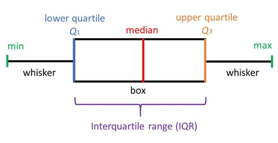
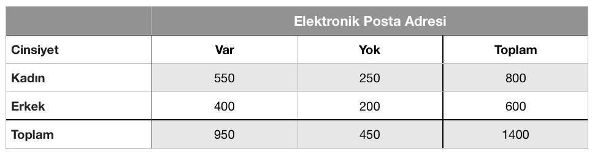

```{r setup, include=FALSE}
options(htmltools.dir.version = FALSE)
library(knitr)
knitr::opts_chunk$set(warning = FALSE, message = FALSE)
# options(knitr.table.format = "html")
library(tidyverse)
library(babynames)
library(fontawesome) # from github: https://github.com/rstudio/fontawesome
library(DiagrammeR)
```

layout: true
  
<div class="my-footer"><span>Marmara University/Computer Engineering</span></div>

<!-- this adds the link footer to all slides, depends on my-footer class in css-->

---
name: xaringan-title
class: center
background-image: url("img/franki-chamaki-1K6IQsQbizI-unsplash.jpg")
background-size: cover


# Mühendisler için İstatistik

## Dr. Busenur Kızılaslan | 2021

<!-- this ends up being the title slide since seal = FALSE-->

---

class: right, middle


# bana ulaşmak için...

  
[`r fa(name = "github")` @busenurk](https://github.com/busenurk)  
[`r fa(name = "link")` googlescholar/busenurkizilaslan](https://scholar.google.com.tr/citations?user=OKlYJEgAAAAJ&hl=tr&oi=ao)  
[`r fa(name = "link")` avesis/busenurkizilaslan](https://avesis.marmara.edu.tr/busenur.sarica)    
[`r fa(name = "paper-plane")` busenur.sarica@marmara.edu.tr](mailto:busenur.sarica@marmara.edu.tr)

---
class: right
background-image: url("img/matthew-henry-2Ts5HnA67k8-unsplash.jpg")
background-size: cover

# Ders Planı

--

## Her perşembe

--

## Ders | 09:00 - 09:50 

--

## Kahve molası | 09:50 - 10:00 

--

## Ders | 10:00 - 10:50 

---

class: left,middle
# Kaynaklar
----------------

### 📙 Olasılık ve İstatistiğe Giriş (Mühendisler ve Fenciler için) | Sheldon M. Ross

### 📕 Mühendisler için Uygulamalı İstatistik ve Olasılık | Douglas C. Montgomery, George C. Runger 

### 📘 Olasılık ve İstatistik | Semra Oral Erbaş

---

# Ders İçeriği  🚀

 İstatistiğe Giriş ve Mühendislikteki Önemi

--

 Betimleyici İstatistik <br>

--

 Olasılığın Temelleri <br>

--

 Rastgele Değişkenler <br>

--

 Kesikli ve Sürekli Dağılımlar <br>

--

 Örnekleme İstatistiklerinin Dağılımları <br>

--

 Parametre Tahmini <br>

--

 Hipotez Testi <br>

--

 `Bonus! Regresyona Giriş`

---
class: left, middle, inverse
background-image: url("img/davisuko-5E5N49RWtbA-unsplash.jpg")
background-size: cover

# İSTATİSTİK NEDİR ?

---
class: middle, center

# İstatistik veriden öğrenme sanatıdır. 

## Sheldon M. Ross

---
class: middle, right
background-image: url("img/kelli-tungay-2LJ4rqK2qfU-unsplash.jpg")
background-size: cover


### .salt[toplanması] 

--

### .acid[düzenlenmesi] 

--

### .heat[analizi]

--

### .salt[yorumlanması] 

--

### .fat[sunulması]

---
class: middle, left, inverse
background-image: url("img/nick-fewings-C2zhShTnl5I-unsplash.jpg")
background-size: cover

#Ne işime yarayacak?

---
class: middle, right
background-image: url("img/gavin-allanwood-rObq1WBp_Ew-unsplash.jpg")
background-size: cover


---
class: middle, right
background-image: url("img/freestocks-11SgH7U6TmI-unsplash.jpg")
background-size: cover

---
class: middle, right
background-image: url("img/bao-menglong-yXkKfvGaipw-unsplash.jpg")
background-size: cover

---
class: middle, right
background-image: url("img/thisisengineering-raeng-qI7USKbZY_A-unsplash.jpg")
background-size: cover

---
class: middle, right
background-image: url("img/possessed-photography-g29arbbvPjo-unsplash.jpg")
background-size: cover

---

class: right, inverse
background-image: url("img/jason-tuinstra-551608-unsplash.jpg")
background-size: cover


#Yapay öğrenmenin (machine learning) altında yatan ana teori istatistiğe dayanır.

Ethem Alpaydın, "Yapay Öğrenme, Yeni Yapay Zeka", (2020), 35.


---
class: left

# Neden Önemli?

<br>

 📎 [Değişkenlik](#block1) ve çeşitlilik söz konusu olmasaydı istatistiksel yöntemlere gerek kalmazdı.

<br>

--

 📎 Değişkenliği tanımlamak, analiz etmek ve sınıflandırmak istatistiğin temel konularıdır.

<br>

--

`Toplam Değişkenlik = Açıklanabilen Değişkenlik + Tesadüfi Değişkenlik`

<br>

--

📎 İstatistik, [rassallık (randomness)](#block1) içeren değişkenlikle ilgilenir.

<br>

--

📎 İstatistik, değişkenliğin varlığında karar vermekte ve sonuç çıkarmakta yardımcı olan bilim dalıdır.

---
class: center

### .heat[İstatistik]

.pull-left[
# ↙️
## Betimsel İstatistik
Verilerin toplanması, özetlenmesi, tablolar ve grafiklerle sunulması, dağılım ve yayılım ölçütleri ile konum ve dağılımlarının belirlenmesi
]


.pull-left[
# ↘️
## Çıkarımsal İstatistik
Anakütleden rastgele seçilen örneklem verilerini kullanarak anakütle parametrelerinin tahmin edilmesi ve hipotezlerin araştırılması 
]


---

# Temel Kavramlar

.saltinline[Kitle (popülasyon anakütle, anakitle, yığın, evren, **population**):] İstatistikte ilgilenilen özelliğe sahip bütün birimlerin oluşturduğu topluluk.

🐱 Türkiye kedileri 

--

.saltinline[Örneklem (örnek, **sample**):] Kitleden rastgele seçilen daha az sayıda birimden oluşan topluluk. Kitlenin alt kümesidir.

🐱 İstanbul kedileri

--

.saltinline[Parametre:]  Anakütlenin tanımlayıcı sayısal ölçüsüdür. Yani, tüm anakütleyi oluşturan birimlerden hesaplanan sayısal ölçülerdir.

--

.saltinline[İstatistik:] Örneklemin tanımlayıcı sayısal ölçüsüdür. Yani, örneklemi oluşturan birimlerden hesaplanan sayısal ölçüdür.

--

.saltinline[Değişken (**variable**):] İlgilenilen kitlenin bir karakteristiği veya özelliğidir. Birimlerin farklı değerler alabildikleri nitelik veya niceliklerdir.

🐱 Kedilerin kilosu, boyu, cinsiyeti, rengi

---

class: middle, center
background-image: url("img/joe-woods-4Zaq5xY5M_c-unsplash.jpg")
background-size: cover

.pull-left[

#Anakütle

#🔃

#Parametre

]

.pull-right[

#Örneklem

#🔃

#İstatistik

]

---

# Veri Türleri

<br>

### Veriler [ölçüm türüne](#block) göre .heatinline[sayısal] ve .heatinline[kategorik] olmak üzere iki grupta toplanır.

<br>

--

### Veriler [derlenme şekillerine](#block) göre de .fatinline[zaman serisi] ve .fatinline[yatay kesit] verisi olmak üzere sınıflandırılmaktadır. 

---

.pull-left[

###Sayısal (nicel) veriler

Gelir, Fiyat, Yaş

Üretim, maliyeti

]

--

.pull-right[

<br>

```{r echo=FALSE}
library(tidyverse)
diamonds[(1:5),-(2:4)]

```

]

--

<br>

.pull-left[

###Kategorik (nitel) veriler

Cinsiyet, Gelir grupları (düşük, orta)

Eğitim düzeyleri (ilk, orta, üni)

Meslek (memur, işçi)

]

--

.pull-right[

<br>

```{r echo=FALSE}
library(tidyverse)
diamonds[(1:5),(2:4)]

```

]


---

.pull-left[

##Zaman Serileri

Belirli zaman aralığındaki; döviz kurları,

faiz oranları, enflasyon oranı

]

.pull-right[

```{r}
AirPassengers
```


]

--

##Yatay Kesit Verileri

Sabit bir zamanda gözlenerek elde edilmiş verilerdir. Anket yoluyla derlenen veriler örnek olarak verilebilir. 

2007 yılının Ocak ayında Türkiye’de illere göre otomobil sayısı, Akdeniz Ülkelerinin her birine 2009 yılının 3. çeyreğinde (temmuz-eylül) gelen toplam turist sayısı

<br>

🍎 Bknz.Panel veri

---

#Veri Ölçüm Düzeyleri (Ölçekler)

.heatinline[Sınıflama Ölçeği (Nominal Ölçek):] Gözlem sonuçları benzerliklerine veya farklılıklarına göre sınıflandırılıyorsa bu ölçek sınıflama ölçeği olarak adlandırılır. 

Cinsiyet, meslek, tutulan takım örnek olarak verilebilir. 

⚽ Galatasaray = 1

⚽ Beşiktaş = 2 

⚽ Fenerbahçe = 3

**Burada atanan değerler üstünlük durumunu temsil etmez.**

<br>

--

Nominal ölçekle elde edilen verilerle; 

  - aritmetik ortalama hesaplanamaz, anlamı yoktur.
  
  - frekans (sıklık), oransal frekans (görseli sıklık), mod gibi  değerler hesaplanabilir.

---

#Veri Ölçüm Düzeyleri (Ölçekler)

.heatinline[Sıralama Ölçeği (Ordinal Ölçek):] Gözlem sonuçları bir sınıflamaya tabi tutulmakla beraber belli bir özelliğe sahip olma bakımından sıralanabiliyorsa bu sıralama ölçeğidir.

Eğitim durumu; İlköğretim, Lise, Lisans, Y. Lisans gibi

Sağlık durumu; kötü, orta, iyi gibi

Yarışma sonucu dereceler; birinci, ikinci, üçüncü

**Verilen değerler sıralama amaçlı olup matematiksel anlam taşımamaktadır.**

<br>

Sıralama ölçeğiyle elde edilen verilerle; 

  - aritmetik ortalama hesaplanamaz, anlamı yoktur.
  
  - birikimli frekans , birikimli oransal frekans, medyan gibi  değerler hesaplanabilir.
  
---

#Veri Ölçüm Düzeyleri (Ölçekler)

.heatinline[Eşit Aralıklı Ölçek:] Nominal ve sıralı ölçek türlerine göre daha hassas bir ölçme sağlar ve sayıların sırasının ve sayılar arası uzaklığın bir anlamı vardır.

Sıfır noktası isteğe bağlı olarak tanımlandığından sıfır değeri ölçülen özelliğin bulunmadığı anlamını taşımaz.

<br>

| Şehir | Sıralama Ölçeği | Eşit Aralıklı Ölçek |
|:----:|:----:|:----:|
|Antalya|1 (10)|24 C|
|Ankara|2 (20)|19 C|
|Kars|3 (30)|11 C|

<br>

**Sıralama ölçeğinde** yer alan 1, 2, 3 sayısal değer ifade etmediğinden 10, 20, 30 olarak da seçilebilir. 

**Eşit aralıklı ölçekte** ise ölçüm değerleri arasındaki farklar önemlidir, bu bakımdan Antalya-Ankara arası sıcaklık farkının (24-19=5), Ankara-Kars arası sıcaklık farkından (19-11=8) az olduğu söyleyenebilir.

---

#Veri Ölçüm Düzeyleri (Ölçekler)

.heatinline[Oran Ölçeği:] Bahsi geçen diğer ölçeklerin bütün özelliklerini taşımakla birlikte hepsinden üstündür. Değerler arası farkı belirleyebilir ve bu değerlerin birbirine göre oranının bulunmasına imkan tanır.

--

Oran ölçeğinin aralık ölçeğinden farkı sıfır noktasının isteğe bağlı olmadan tanımlanmasıdır. 

--

Yaş, ağırlık, ücret ve not gibi anlamlı bir sıfır değerine de sahip olan ölçme düzeyidir.

--

<br>

.saltinline[Sınıflama ve sıralama ölçeklerinde ölçülen değişkenler nitel (kategorik, sayısal olmayan) değişkenlerdir.]


--

<br>

.saltinline[Eşit aralık ve oran ölçekleride ölçülen değişkenler nicel (sayısal) değişkenlerdir.]


---

#Verilerin Düzenlenmesi

Kitle veya örneklemden belirli değişkenler için çeşitli ölçeklere göre alınan ölçüm (gözlem) sonuçlarının oluşturduğu kümeye `veri` denir.

Verinin özetlenmesi için yapılan işlemlerden biri frekans (sıklık) dağılımlarını oluşturmaktır.

```{r}
mtcars %>% head(5)
```


```{r}
library(plyr)
d1<- mtcars %>% count("gear");d1 
```

---

Frekans dağılımları birçok grafik tipinde kullanılır.

.pull-left[

.saltinline[Bar Grafik]

```{r fig.height=5, fig.width=7}
bar<-ggplot(data=d1, aes(x=gear, y=freq, fill=gear)) +
    geom_bar(stat="identity");bar

```
]

.pull-right[

.saltinline[Pasta Grafik]

```{r fig.height=6, fig.width=6}
bar + coord_polar("y", start=0)
```

]

---

.saltinline[Histogram]

Koordinat eksenleri üzerinde her sınıf için çizilen dikdörtgenlerden oluşan grafiktir. Bu dikdörtgenlerin taban kenar uzunlukları sınıf aralığına eşittir. Diğer kenar uzunluğu da sınıfların frekansına eşittir.

```{r message=FALSE, paged.print=TRUE}
library(dslabs)
attach(gapminder)
gapminder %>% head(5)
dim(gapminder)
```
---

.saltinline[Histogram]

```{r fig.height=5, fig.width=7}
library(hrbrthemes)
ggplot(gapminder, aes(x=fertility)) +
    geom_histogram( binwidth=3, fill="#69b3a2", color="#e9ecef", alpha=0.9) +
    theme_ipsum() +
    theme(
      plot.title = element_text(size=15)
    )
```

---

.saltinline[🌿 Dal Yaprak Grafiği]

.pull-left[

```{r}
a<-1:50;a
```

]

.pull-right[

```{r}
a %>% stem()
```
]

---

#Verilerin Özetlenmesi

Verilerin özetlenmesi amacıyla merkezi eğilim ve dağılım ölçülerinden faydalanılır.

<br>

.satlinline[Merkezi eğilim ölçüleri;] verideki gözlem değerlerinin etrafında toplandığı değerler merkezi eğilim ölçüleri olarak adlandırılır.

🔻 Aritmetik ortalama, medyan (ortanca), mod (tepe değer), geometrik ortalama, harmonik ortalama


<br>

--

.satlinline[Merkezi dağılım ölçüleri;] verideki gözlem değerlerinin birbirlerine göre konumlarını, birbirlerine olan yakınlık ve uzaklıklarını yansıtan değerler ise merkezi dağılım ölçüleri olarak adlandırılır.

🔻 Değişim genişliği (range), varyans, standart sapma, değişim katsayısı

--

<br>

Bu bölüm altında dağılımın şeklini gösteren **çarpıklık (skewness)** ve **basıklık (kurtosis)** katsayıları da incelenecektir.

---

#Verilerin Özetlenmesi

<br>

En çok kullanılan eğilim ölçülerini vermeden önce iki önemli kavramı hatırlamakta fayda olacaktır.

<br>

.heatinline[Gruplanmamış veri;] $x_{1}, x_{2}, x_{3},..., x_{n}$ gözlemler seti

<br>

--

.heatinline[Gruplanmış veri;] $x_{1}, x_{2}, x_{3},..., x_{k}$ gözlemler seti olup her bir sınıfa $f_{1}, f_{2},..., f_{k}$  frekansları karşılık gelir. Gözlemlerin toplam sayısı frekansların toplamına eşittir.


---

####.salt[Aritmetik Ortalama]

<br>

🔹 Gözlem değerlerinin toplamının gözlem sayısına bölümü olarak tanımlanır.

--

🔹 Gözlem değerlerinin etrafında toplandığı merkezi ifade eder.

--

🔹 En çok kullanılan merkezi eğilim ölçüsüdür.

--

🔹 Popülasyon (kitle) için aritmetik ortalama $\mu$ ile gösterilir.

--
 
🔹 Örneklem için aritmetik ortalama $\bar{x}$ ile gösterilir.

--

🔹 Yalnızca nicel veri için mevcuttur.

--

🔹 **Birim değerlerinde meydana gelen değişme çok küçük bile olsa aritmetik ortalama etkilenir.**

---

.heatinline[Gruplanmamış veriler için aritmetik ortalama;]

<br>

$\Large \mu=\frac{\sum_{i=1}^{N} x_{i}}{N}=\frac{x_{1}+x_{2}+x_{3}...+x_{N}}{N}$

<br>

--

>Yığın gözlem sayısı için N, örneklem gözlem sayısı için n kullanılır.

<br>

--

Ancak yığın değerlerine ulaşmak her zaman mümkün olmadığından çoğu kez yığından rastgele olarak alınmış örneğin aritmetik ortalamasına ihtiyaç duyulur.

<br>

--

$\Large \bar{x}=\frac{\sum_{i=1}^{n} x_{i}}{n}=\frac{x_{1}+x_{2}+x_{3}...+x_{n}}{n}$

<br>

---

.heatinline[Gruplanmış veriler için aritmetik ortalama;]

Yığın için;

--

$\Large \mu=\frac{\sum_{j=1}^{k}x_{j}f_{j}}{N}=\frac{x_{1}f_{1}+x_{2}f_{2}+...+x_{k}f_{k}}{N}$

<br>

--

Örnek için;

$\Large \bar{x}=\frac{\sum_{j=1}^{k}x_{j}f_{j}}{n}=\frac{x_{1}f_{1}+x_{2}f_{2}+...+x_{k}f_{k}}{n}$


🔆 Bir kreşteki çocukların yaşlarına göre dağılımı aşağıdaki gibi verilmiştir. Aritmetik ortalamayı bulunuz.

.pull-left[

|xj (yaş)|fj|
|:-----------:|:-----:|
|1|6|
|2|12|
|3|14|
|4|9|
|5|6|
| |N=47|

]

.pull-right[

$\Large \mu=\frac{\sum_{j=1}^{k}x_{j}f_{j}}{N}=\frac{1(6)+2(12)+4(9)+5(6)}{47}=2.94$


]

---

class: center,inverse
background-image: url("img/jason-tuinstra-551608-unsplash.jpg")
background-size: cover

#Birim değerlerinde meydana gelen değişme çok küçük bile olsa aritmetik ortalama etkilenir.

---

####.salt[Aritmetik Ortalama]

```{r}
comp<-1:50
comp
```

--

```{r}
mean(comp)
```

<br>

--

```{r}
comp1<-c(comp,510)
comp1
```


--

```{r}
mean(comp1)
```

---

####.salt[Medyan (Ortanca)]

<br>

🔹 Bir verideki gözlem değerleri .heatinline[küçükten büyüğe doğru sıralandığında] ortadaki değere medyan denir.

<br>

--

🔹 Medyan veriyi ortadan ikiye böler.

<br>

--

🔹 Nicel ve ordinal değişkenler için kullanılabilir.

<br>

--

<br>

**Aykırı değerlerden etkilenmez. Veride aykırı değer olması durumunda ortalamanın yerine tercih edilir.**

---

.saltinline[Gruplanmamış veriler için medyan;]

<br>


Toplam gözlem sayısının çift veya tek olmasına göre aşağıdaki gibi bulunur.

<br>

$\Large {x_{(\frac{N+1}{2})}}$  , N tek ise

<br>

--

$\Large \frac{x_{(\frac{N}{2})}+x_{(\frac{N}{2}+1)}}{2}$  , N çift ise

<br>

--

🔆 3, 4, 5, 8, 8, 9, 10 şeklinde sıraya dizilen 7 birimin medyanı (ortancası),

$\Large x_{medyan}=x_{\frac{N+1}{2}}=x_{\frac{7+1}{2}}=x_{(4)}=8$


---

🔆 Bir markette 10 kasada belli bir zaman aralığında sıraya giren müşteri sayısı aşağıdaki gibi verilmiştir. Medyanı bulunuz.

$x_{i}$=32, 58, 27, 44, 36, 28, 42, 51, 39, 50

```{r}
x<-c(32, 58, 27, 44, 36, 28, 42, 51, 39, 50)    # sıralı değil, sıralanmalı
xs<-sort(x,decreasing = F);xs

N=length(x);N

m1=xs[N/2];m1
m2=xs[(N/2+1)];m2
(m1+m2)/2

```

.saltinline[Çift gözlem sayısında, ortanca değerin iki gözlemin arasına düşmesi sebebiyle bu gibi bir ortalama hesabı yapılıyor.]


---

class: center,inverse
background-image: url("img/jason-tuinstra-551608-unsplash.jpg")
background-size: cover

#Medyan aşırı uç değerlerden etkilenmez. Bu yönden aritmetik ortalamadan üstündür. Ancak aritmetik ortalamanın daha hassas olduğu unutulmamalıdır.

---

####.salt[Mod (Tepe Değer)]

📌 Bir veride en çok tekrarlanan değere mod denir.

--

📌 Nitel ve nicel veriler için uygundur.

--

📌 Gözlemlerin tümü işleme katılmadığından uç değerlerden etkilenmez.

--

📌 Her gözlem bir kez ortaya çıkmış ise mod mevcut değildir.

--

📌 Bir veride birden fazla mod değeri olabilir, bu durumda kullanılması uygun değildir.

--

<br>

.saltinline[Gruplanmamış veriler için mod;] Veride en çok tekrar eden gözlemdir.

<br>

🔆 12, 14, 14, 15, 15, 16, 17, **18**, **18**, **18**, 19, 20 için mod değeri 18 dir.

---

class: center,inverse
background-image: url("img/jason-tuinstra-551608-unsplash.jpg")
background-size: cover

##Mod, hassaslığı en az olan ölçüdür. Çünkü mod yer ve birimlerin değer değiştirmesinden etkilenmez. En yüksek frekans aynı sınıfta kaldıkça diğer sınıflarda ve değerlerde meydana gelecek değişiklikler modu değiştirmez.

---

####.salt[Geometrik Ortalama]

📌 Gözlem sonuçlarının herbiri bir önceki gözlem sonucuna bağlı olarak değişiyorsa ve bu değişmenin hızını saptamak gerekiyorsa geometrik ortalamayı kullanmak gerekir.

--

📌 Aykırı değerlerden aritmetik ortalama kadar etkilenmez.

--

$\Large G=\sqrt[n]{\prod_{i=1}^{n}x_{i}}$

--

<br>

🔆 Bir şehirdeki son dört yıllık nüfus değerleri (bin olarak) 100, 180, 210, 300 dür. Bu şehrin son dört yıllık ortalama nüfus artışı yüzde kaçtır?

.pull-left[

Yıllık artış oranları;

180/100=1.8

210/180=1.16

300/210=1.42
]

.pull-right[

$G=\sqrt[3]{(1.8)(1.16)(1.42)}=1.437$


Böylece son dört yıllık ortalama nüfus artışı %43.27 dir.]

---

####.salt[Harmonik Ortalama]

📌 Bir dizideki verilerin birbirleri ile ilişkisi düzensiz ise aralarında belirli bir uyum yok ise kullanılır. Özellikle zaman dizilerinde verilerin ani ve beklenmeyen olaylardan etkilendiği durumlarda harmonik ortalama en uygun ortalamadır.

--

📌 Birim fiyat ile alınan ortalama miktarı veya bir ürünün bir biriminin üretimi için harcanan ortalama zaman gibi ortalamaları hesaplamak için kullanılır.

--

📌 Birim değerlerinden en az birinin sıfır olduğu durumda hesaplanamaz.

--

📌 Küçük değerlerden çok, yüksek değerlerden az etkilenir.

<br>

$\Large H=\frac{1}{\frac{1}{n}\sum_{i=1}^{n}\frac{1}{x_{i}}}$

--

🔆 Bir tekstil fabrikasında çalışan dört kişinin bir pantolonu ütüleme süreleri 10dk, 6dk, 4dk ve 5dk dır. Buna göre bu fabrikada bir pantolon ortalama kaç dakikada ütülenir?

$\Large H=\frac{1}{\frac{1}{4}(\frac{1}{10}+\frac{1}{6}+\frac{1}{4}+\frac{1}{5})}=5.58$ dk

---
class: center, middle
background-image: url("img/hello-i-m-nik-MAgPyHRO0AA-unsplash.jpg")
background-size: cover


.pull-left[

####.heat[<u>Merkezi Eğilim Ölçüleri</u>]

####.heat[Aritmetik Ortalama]

####.heat[Medyan]

####.heat[Mod]

####.heat[Geometrik Ortalama]

####.heat[Harmonik Ortalama]

]

.pull-right[

####.fat[<u>Merkezi Dağılım Ölçüleri</u>]

####.fat[Varyans]

####.fat[Standart Sapma]

####.fat[Değişim Katsayısı]

####.fat[Değişim Genişliği]

]

---

####.salt[Varyans ve Standart Sapma]

<br>

🔻 Varyans, gözlem değerlerinin aritmetik ortalamadan sapmalarının karelerinin ortalaması olarak tanımlanır.

<br>

--

🔻 Varyansın pozitif kareköküne .heatinline[Standart Sapma] denir.

<br>

--

🔻 En sık kullanılan dağılım ölçüleridir.

<br>

--

🔻 Popülasyon için varyans, $\sigma^{2}$ ve standart sapma, $\sigma$ ile gösterilir.

<br>

--

🔻 Örneklem için varyans, $S^{2}$ ve standart sapma $S$ ile gösterilir.

---

###.saltinline[Örneklem için varyans]

<br>

.pull-left[

$\LARGE S^{2}=\frac{1}{n-1}\sum_{i=1}^{n}(x_{i}-\bar{x})^{2}$

]

.pull-right[

n: toplam gözlem sayısı

$x_{i}$: i. gözlem değeri

$\bar{x}$: gözlemlerin ortalaması

]

<br>

--

###.saltinline[Örneklem için standart sapma]

<br>

$\LARGE S=\sqrt{\frac{1}{n-1}\sum_{i=1}^{n}(x_{i}-\bar{x})^{2}}$

---

###📎 Varyansın birimi gözlemlerin birimlerinin karesidir. Örneğin, $cm$ birimine sahip uzunluk verileri için varyans hesaplandığında birim $cm^{2}$ olacaktır.

<br>
--

###📎 Standart sapmanın birimi ise gözlem birimi ile aynıdır. Bu nedenle verinin yayılımı için genellikle tercih edilir.

<br>
--

###📎 Gözlemlerin ortalama etrafındaki yayılımı arttıkça standart sapma (ve varyans) büyür. Tersi olarak gözlem değerleri birbirine benzer ise ortalamadan sapma az olacak ve standart sapma küçük olacaktır.

<br>
---
class: center,inverse
background-image: url("img/jason-tuinstra-551608-unsplash.jpg")
background-size: cover


###Standart sapma (veya varyans) .heatinline[küçük] olduğunda gözlemlerin birçoğu birbirine benzerdir yani gözlemler .heatinline[homojendir.]

--

###Standart sapma .heatinline[büyük] ise, gözlemlerin çoğunluğu birbirinden farklıdır yani gözlemler .heatinline[heterojendir.]

---

🔆 10, 15, 22, 26, 31, 40 örnek verilerinin varyansı ve standart sapması nedir?

<br>

.pull-left[
| $x_{i}$ | $(x_{i}-\bar{x})$ | $(x_{i}-\bar{x})^{2}$ |
|:-----:|:---------------:|:-------------------:|
|10|-14|196|
|15|-9|81|
|22|-2|4|
|26|2|4|
|31|7|49|
|40 |16 |256 |
| $+$ | | |
|144|0|590|

]

.pull-right[

$\Large \bar{x}=\frac{144}{6}=24$

<br>

$\Large s^{2}=\frac{1}{n-1}\sum_{i=1}^{n}(x_{i}-\bar{x})^{2}=\frac{590}{5}=118$

<br>

$\Large s=\sqrt{118}\cong11$
]

---

###.saltinline[Ortalamalar aynı, varyanslar farklı, karşılaştırılabilir ✅]

```{r echo=FALSE}
library(plotly)
fig <- plot_ly(alpha = 0.6)
fig <- fig %>% add_histogram(x = ~rnorm(500,0,2),name="örn1")
fig <- fig %>% add_histogram(x = ~rnorm(500,0,7),name="örn2")
fig <- fig %>% layout(barmode = "overlay")
fig
```


---

###.saltinline[Ortalamalar farklı, varyanslar aynı, karşılaştırılamaz ❌]

```{r echo=FALSE}
library(plotly)
fig <- plot_ly(alpha = 0.6)
fig <- fig %>% add_histogram(x = ~rnorm(500,0,7),name="örn3")
fig <- fig %>% add_histogram(x = ~rnorm(500,8,7),name="örn4")
fig <- fig %>% layout(barmode = "overlay")
fig
```


---

####.salt[Değişim Katsayısı]

Farklı veri setlerinin ortalamaları farklı olduğunda varyans ve standart sapmayı kullanarak bu verilerin değişkenliklerini karşılaştırmak mümkün değildir.

--

Ayrıca, karşılaştırılan verilerin birimleri farklı olduğunda (örneğin yaş ve yıllık maaş gibi) **birimsiz** bir ölçüte ihtiyaç duyulur.

--

###.saltinline[Popülasyon için Değişim Katsayısı (DK)]

$\LARGE DK=\frac{\sigma}{\mu}$


<br>

--

###.saltinline[Örneklem için Değişim Katsayısı (DK)]

$\LARGE DK=\frac{s}{\bar{x}}$

---
class: center,inverse
background-image: url("img/jason-tuinstra-551608-unsplash.jpg")
background-size: cover

###Değişim katsayısı .heatinline[küçük] olan verinin gözlem değerleri arasındaki değişimin az yani .heatinline[homojen] olduğunu, değişim katsayısı .heatinline[büyük] olan verinin ise gözlem değerleri arasındaki değişimin daha çok yani .heatinline[heterojen] olduğunu söyleyebiliriz.

---

🔆 6 kadın ve 9 erkek izleyicinin belli bir günde kaç saat TV seyrettiği aşağıda verilmiştir. Kadınlar mı yoksa erkekler mi TV seyretme süresi bakımından daha homojendir? (her iki grubun anakitle olduğu varsayılıyor.)


**Kadın:** 4,7,4,3,5,1

**Erkek:** 6,6,8,9,2,7,6,5,1

<br>

.pull-left[

$\large \mu_{K}=\frac{4+7+4+3+5+1}{6}=4$

$\large \sigma_{K}^{2}=\frac{(4-4)^{2}+(7-4)^{2}+...+(1-4)^{2}}{6}\cong 3.33$

$\large \sigma_{K}=\sqrt{3.33}=1.83$

<br>

$\large \mu_{E}\cong 5.55$

$\large \sigma_{E}^{2}=6.02$

$\large \sigma_{E}=2.45$
]

.pull-right[

$\large DK_{K}=\frac{\sigma_{K}}{\mu_{K}}=\frac{1.83}{4}$

<br>

$\large DK_{E}=\frac{\sigma_{E}}{\mu_{E}}=\frac{2.45}{5.55}$

<br>

#### ☝🏾 $\mu_{K}<\mu_{E}$ ve $\sigma_{E}>\sigma_{K}$ olduğu görülmektedir. Ancak $DK_{E}<DK_{K}$ bulunarak 9 erkek TV izleyicisinin 4 kadın TV izleyicisine göre TV izleme sürelerinin daha homojen olduğu belirlenmiştir.

]


<br>


---

####.salt[Değişim Genişliği (range)]

<br>

İlgili değişkene ilişkin gözlemlerin en büyük değeri ile en küçük değeri arasındaki farka değişim genişliği (range) denir.

<br>

$\Large R=x_{max}-x_{min}$

<br>

Değişim genişliği, değişim aralığını gösteren bir dağılım ölçüsü olup en kaba ölçülerden biridir. Bunun nedeni hesaplamaya yalnızca max ve min değerlerin dahil edilmesidir.
---
background-image: url("img/morgan-housel-PcDGGex9-jA-unsplash.jpg")
background-size: cover

<br>

###Veri seti için en önemli özelliklerden biri de verilerin hangi biçimde bir dağılıma sahip olduğunun belirlenmesidir. 

<br>

###Veri tek tepeli mi yoksa çok tepeli mi?

<br>

###Veri tek tepeli ise simetrik mi yoksa çarpık mı?

---

####.salt[Çarpıklık (Skewness) Katsayısı]

<br>

Dağılımın çarpıklığı hakkında bilgi veren bir ölçü **çarpıklık** katsayısıdır.

<br>

###.saltinline[Çarpıklık katsayısı]

$\LARGE \gamma_{1}=\frac{\frac{1}{n}\sum_{i=1}^{n}(x_{i}-\bar{x})^{3}}{S^{3}}$

<br>

$\Large \gamma_{1}>0$ ise dağılım sağa çarpıktır.

$\Large \gamma_{1}<0$ ise dağılım sola çarpıktır.

$\Large \gamma_{1}=0$ ise dağılım simetriktir.

---

###.saltinline[Çarpıklık Değerlendirmesi]

```{r echo=FALSE}
library(plotly)
fig <- plot_ly(alpha = 0.6)
fig <- fig %>% add_histogram(x = ~rexp(1000,rate=2), name="Sağa çarpık")
fig <- fig %>% add_histogram(x = ~rnorm(1000,0,1), name="Simetrik")
fig <- fig %>% add_histogram(x = ~rbeta(1000,2,0.5,ncp=2), name="Sola Çarpık")
fig <- fig %>% layout(barmode = "overlay")
fig
```


---

####.salt[Basıklık (Kurtosis) Katsayısı]

<br>

Verinin dağılım grafiğinin normal dağılıma göre daha sivri mi yoksa daha basık mı olduğunun bilgisi basıklık katsayısı verir.

<br>

###.saltinline[Basıklık katsayısı]

$\LARGE \gamma_{2}=\frac{\frac{1}{n}\sum_{i=1}^{n}(x_{i}-\bar{x})^{4}}{S^{4}}-3$

<br>

$\Large \gamma_{2}>0$ ise dağılım, normal dağılıma göre daha sivridir.

$\Large \gamma_{2}<0$ ise dağılım, normal dağılıma göre daha basıktır.

$\Large \gamma_{2}=0$ ise dağılım, normal dağılıma sahiptir.

---

###.saltinline[Basıklık Değerlendirmesi]

```{r echo=FALSE}
library(plotly)
fig <- plot_ly(alpha = 0.6)
fig <- fig %>% add_histogram(x = ~rnorm(10000, m=0, sd=0.05), name="Sivri")
fig <- fig %>% add_histogram(x = ~rnorm(10000, m=0, sd=1), name="Normal")
fig <- fig %>% add_histogram(x = ~rnorm(10000, m=0, sd=3), name="Basık")
fig <- fig %>% layout(barmode = "overlay")
fig
```

---

####.salt[Mod, Medyan ve Ortalama ile Çarpıklık Değerlendirmesi]

<br>


---

####.salt[Çeyreklikler (Quartiles)]

Bir verideki gözlemleri küçükten büyüğe doğru sıraladığımızda sıralanmış verileri dört eşit parçaya bölen değerlere çeyrek değerler denir.

<br>


.pull-left[

🌀 Birinci çeyreklik $Q_{1}$, verinin ilk %25'lik kısmını içinde barındırır.


<br>

🌀 İkinci çeyreklik $Q_{2}$, ortanca olup veriyi ortadan ikiye böler.


<br>

🌀 Üçüncü çeyreklik $Q_{3}$, verinin %75'lik kısmını içinde barındırır.

]

.pull-right[

<br>

]

---

####.salt[Çeyrekliklerin Hesaplanması]

Veri küçükten büyüğe sıralanır.

📎Birinci çeyreklik sıralanmış veride sıra numarası $\frac{(n+1)}{4}$ olan gözlem değeridir.

$\Large Q_{1}=x_{(\frac{n+1}{4})}$

<br>

--

📎İkinci çeyreklik sıralanmış veride sıra numarası $\frac{(n+1)}{2}$ olan gözlem değeridir.

$\Large Q_{2}=x_{(\frac{n+1}{2})}$

<br>

--

📎Üçüncü çeyreklik sıralanmış veride sıra numarası $\frac{3(n+1)}{4}$ olan gözlem değeridir.

$\Large Q_{3}=x_{(\frac{3(n+1)}{4})}$

---

####.salt[Kutu Grafiği (Box Plot)]

Kutu grafiği çeyreklikler kullanılarak verinin yapısını ortaya çıkarmak için kullanılan basit bir grafiksel yöntemdir. Grafiğin çizimi;

.pull-left[

$Q_{1}=(n+1)/4$

$Q_{3}=3(n+1)/4$

]

.pull-right[

Alt limit(min) $=Q_{1}-1.5(Q_{3}-Q_{1})$

Üst limit(max) $=Q_{3}+1.5(Q_{3}-Q_{1})$

]

Veride alt limitin altında veya üst limitin üzerinde bir gözlem yer alıyorsa bu gözlem **aykırı değer** olarak nitelendirilir.


---

.pull-left[

```{r echo=FALSE}
muk<-c(83,63,81,76,54,87,84,86,84,60,71,90,92,78,92,84,53,68,80,83,84,71,65,81,94,73,95,82,81,71,76,92,69,61,102,84,67,68,108,88,82,67,78,89,80,97,103,86,64,97,99,89,76,68,65,94,75,95,103,74,103,94,103,83,88,64,67,81,91,97,84,70,105,99,76,72,96,63,84,82,78,89,80,92,106,73,71,70,94,76,71,75,91,81,70,78,56,73,68,82,88,78,81,71,73,81,94,90,61,71,64,54,93,86,87,81,71,65,90,74)

N=length(muk)    #gozlem sayisi

boxp1 <- plot_ly(y = muk, type = "box",name="Mukavemet"); boxp1
```

]

.pull-right[

```{r echo=FALSE}
t<-rnorm(1000)^2
boxp2 <- plot_ly(y = t, type = "box",name="Norm^2"); boxp2

```

]

---

Çarpıklığı yatay eksende gözlemek daha iyi kavramamızı sağlayacaktır. Verinin sağa çarpık olduğu ve fazla miktarda aykırı değer içerdiği kutu grafikten gözlenebilmektedir.


```{r echo=FALSE}
boxp2.horizontal <- plot_ly(x = t, type = "box",name="Norm^2 Horizontal"); boxp2.horizontal
```


---

```{r}
library(dplyr)
mtcars %>% head(10)
attach(mtcars)
hp
summary(hp)
sd(hp)

```

---

```{r}

fig <- plot_ly(alpha = 0.6)
fig <- fig %>% add_histogram(x = ~hp,name="hp")
fig <- fig %>% layout(barmode = "overlay")
fig

```

---

```{r}
plot_ly(x = hp, type = "box",name="Hp")

```

---

```{r}
mtcars[which(hp==335),]
```

 

---

####.heat[🚀 OLASILIK NEDİR?]

<br>

Gelecekte ortaya çıkması muhtemel olayın olabilirliğinin ölçüsü

<br>

.pull-left[

Belirsizliğin ölçüsü

<br>

Çıkarsama için güvenilirliğin ölçüsü

<br>

Rastgeleliğin ölçüsü

]

.pull-right[

```{r pressure, echo=FALSE, fig.cap="", out.width = '50%'}
knitr::include_graphics("https://media.giphy.com/media/ygzkZPxmh6HgUzbYFz/giphy.gif")
```


]


Olasılık istatistiğin önemli bir kısmıdır. `Rastgeleliğin` veya `belirsizliğin` olduğu durumlarda karar vermede olasılık teorisi önemli rol oynar. Kitle hakkında bu kararları verirken **örneklemlerden** elde edilen bilgiler kullanılır.

---

**.heatinline[Rastgele deney:]** Deneyin sonuçlarını bilmekle birlikte deney gerçekleştiğinde elde edilenin bilinmemesi.

--

🍒 Bir hilesiz zarı yuvarlama deneyi rastgele deneydir. Sonuçları biliniyor, (1, 2, 3, 4, 5, 6) ancak deney gerçekleştiğinde hangisinin elde edileceği bilinmiyor.

--

<br>

**.heatinline[Örnek nokta:]** Bir rastgele deneyin sonuçlarının her birine örnek nokta denir.

--

🍒 Zar deneyi için örnek noktalar; 1, 2, 3, 4, 5, 6

--

<br>

**.heatinline[Olay:]** Rastgele deneyden elde edilecek sonuçlara ilişkin bir alt küme. Olanaksız olay ise gerçekleşmesi mümkün olmayan olaydır ( $\emptyset$ ), zar deneyi için 7 gelmesi olayı $\emptyset$ dir.

<br>

--

**.heatinline[Örnek uzay:]** Rastgele deneyin tüm sonuçları kümesidir. S ile gösterilir. Olay, S'in alt kümesidir.

Zar deneyi için $S=\{1,2,3,4,5,6\}$

A olayı çift sayı ise $A=\{2,4,6\}$

$A \subset S$

---

.pull-left[

🔆 Bir madeni parayı 2 kez fırlatalım. Örnek uzay,


$S=\{YY,YT,TY,TT\}$

<br>

$B=\{YY,TT\}$     $\gets$ olay çünkü $B \subset S$

<br>

TT $\to$ bir örnek nokta,  $TT\in S$

<br>

$\{TT\}$ $\to$ bir olay $\{TT\}\subset S$

<br>

Kaç olay vardır? 

$2^{n}=2^{2}$

]

.pull-right[

🔆 Hilesiz iki zar birlikte atılıyor. Örnek uzay,

$S=\{(1,1),(1,2),(1,3),...,(2,4),...,(3,4)...,(6,6)\}$

<br>

$F=\{(2,3),(5,6)\}$     $\gets$ olay çünkü $F \subset S$

<br>

(6,6) $\to$ bir örnek nokta,  $(6,6)\in S$

<br>

$\{(5,5)\}$ $\to$ bir olay $\{(5,5)\}\subset S$

<br>

Kaç olay vardır? 

$6^{n}=6^{2}$

]

---

####.heat[Olasılık (Kolmogorov) Aksiyomları] 

<br>

Olasılığın tanımlanmasındaki zorluklar nedeniyle matematikçiler olasılığı bir fonksiyon olarak ifade etmişlerdir. Rus matematikçi Andrey Kolmogorov (1933) aksiyomları ile olasılık fonksiyonunu tanımlamıştır.

.pull-left[

🔻 Herhangi bir olayın olasılığı 0 ile 1 arasındadır. A olayı için,

$0\leq P(A) \leq 1$

<br>

🔻 Örnek uzaydaki noktaların olasılıkları toplamı 1'dir. (S: örnek uzay)

 $P(S)=1$


]

.pull-right[

 


]

<br>

---------------------

📎️ [Andrey Kolmogorov](https://tr.wikipedia.org/wiki/Andrey_Kolmogorov)

---

####.heat[Olasılık (Kolmogorov) Aksiyomları] 

<br>

🔻 A ve B, S örnek uzayındaki herhangi iki **ayrık olay** $(A\cap B=\emptyset)$ olduğunda,

 $P(A\cup B)=P(A)+P(B)$ dır.


<br>

🔻 $A_{1},A_{2},...$ olayları S örnek uzayında tanımlı ayrık olaylar olmak üzere,

$\large P(\cup_{\infty}^{i=1}A_{i})=\sum_{i=1}^{\infty}P(A_{i})$

<br>

🔻 A olayı S örnek uzayının bir alt kümesi olsun. A olayının tümleyeninin olasılığı,

$P(A^{c})=1-P(A)$

---

####.heat[Olasılık Fonksiyonunun Özellikleri]

<br>

S örnek uzay, A ve B bu örnek uzayda iki olay olsun.

🔻 Eğer $P(A)=0$ ise A olanaksız olaydır. Eğer $P(A)=1$ ise A kesin olaydır.

--

🔻 Eğer $A\subset B$ ise $P(A)\leq P(B)$ dir.

--

🔻 Eğer A ile B ayrık olmayan iki olay ise

$P(A\cup B )=P(A)+P(B)-P(A\cap B)$ dir.

**Not:** $A\cap B=\emptyset$ olduğunda A ile B **ayrık olaylardır.**

--

🔻 Eğer A ile B ayrık iki olay ise

$P(A\cup B )=P(A)+P(B)$ dir.

--

🔻 $P(A)+P(A^{c})=1$ dir. Çünkü, $A\cap A^{c}=\emptyset$ dir. Dolayısıyla  $P(A^{c})=1-P(A)$.

---

🔆 Bir paranın 3 kez atıldığı bir deney için örnek uzayı oluşturunuz.

<br>

$S=\{YYY, YYT, YTY, TYY, YTT, TYT, TTY, TTT\}$

<br>

Hiç yazı gelmeme olasılığı; $\large P(0)=\frac{1}{8}$

1 tane yazı gelme olasılığı; $\large P(1)=\frac{3}{8}$

2 tane yazı gelme olasığı; $\large P(2)=\frac{3}{8}$

3 tane yazı gelme olasılığı; $\large P(3)=\frac{1}{8}$

<br>

Yazı gelmesi ile ilgili tüm durumların olasılıkları toplamı;

$P(0)+P(1)+P(2)+P(3)=1$

---
class: inverse
background-image: url("img/benjamin-balazs-PgLOQTUsy1c-unsplash.jpg")
background-size: cover


###.fat[Olasılık Yaklaşımları]

<br>

## ▫️ Klasik olasılık

<br>

## ▫️ Deneysel olasılık

<br>

## ▫️ Subjektif olasılık

---

####.salt[Klasik Olasılık]

Örnek uzaydaki örnek noktalar eşit şanslıdır.

Klasik Olasılık $\Large =\frac{\text{istenen olayın örnek nokta sayısı}}{\text{örnek noktalar sayısı}}=\frac{n(A)}{n(S)}$

<br>

.pull-left[

🔆 Bir zar yuvarlama deneyi için çift sayı gelme olasılığı;

$S=\{1, 2, 3, 4, 5, 6 \}$

$n(S)=6$


$A=\{2, 4, 6 \}$

$n(A)=3$

$\large P(A)=\frac{n(A)}{n(S)}=\frac{3}{6}=\frac{1}{2}$

]

.pull-right[

🔆 Mavi ve sarı bir çift zar yuvarlansın. Zarlar üzerindeki sayıların aynı olması olasılığı nedir?

B: aynı sayı olması

$B=\{(1,1),(2,2),(3,3),(4,4),(5,5),(6,6)\}$

$n(S)=36$

$n(B)=6$

$\large P(B)=\frac{6}{36}=\frac{1}{6}$

]

---

####.salt[Deneysel Olasılık]

Deneysel olasılık $\Large =\frac{\text{istenen olay için gözlem sayısı}}{\text{gözlem sayısı}}=\frac{\text{istenen olayın frekansı}}{\text{toplam frekans}}$

<br>

🔆 Aşağıda bilgisi yer alan çalışmada kadınların oranı (olasılığı) nedir?

<br>

.pull-left[

|Sınıf|Frekans|Relatif Frekans|
|:---:|:---:|:---:|
|K|35| $\large \frac{35}{55}$ |
|E|20| $\large \frac{20}{55}$ |

]

.pull-right[

$\large P(K)=\frac{35}{55}$

]

---

#####.salt[Bir deneysel olasılıkta deneme sayısı arttıkça deneysel olasılık klasik olasılığa yaklaşır.]

<br>

🔆 Hilesiz bir para atışı deneyinde tura gelme sayıları ve relatif frekans lar aşağıdaki gibi verilmiştir.

<br>

.pull-left[

|Deneme sayısı | Tura sayısı | Relatif frekans|
|:--:|:--:|:--:|
|1|0|0|
|5|2|2/5=0.4|
|10|6|6/10=0.6|
|20|11|11/20=0.55|
|50|27|27/50=0.54|
|100|53|53/100=0.53|
|1000|495|495/1000=0.495|
|10000|5010|5010/10000=0.501|

]

.pull-right[

Bu deney için klasik olasılık 1/2 dir.

]

---

####.salt[Subjektif Olasılık]

Kişi ya da gözlemlere dayanarak (ön bilgi üzerinden) bir oran verilmesidir.


Bir sabah kalktığında havanın bulutlu olduğun görüp büyük bir olasılıkla ya da %40 yağmur yağabilir yorumu.

<br>

####.salt[Sayma Teknikleri]

Bir A olayının gerçekleşmesi olasılığı $P(A)$'nın hesaplanmasında A olayının ortaya çıkma sayısının ve örnek uzayın belirlenmesinde bazı teknikler kullanılır.

**.saltinline[Çarpma Kuralı:]** Bir olay n farklı yol ile ortaya çıksın. Bunu izleyen ikinci olay, bu n yolun her biri için m farklı biçimde ortaya çıkıyor ise bu iki olay birlikte $m\times n$ farklı biçimde ortaya çıkar.


**.saltinline[Toplama Kuralı:]** Bir olay farklı yöntemler ile gerçekleşebilir olsun. Birinci yöntem ile bu olay n farklı biçimde, ikinci yöntem ile m farklı biçimde gerçekleşebiliyor ise bu olay toplam $m+n$ farklı biçimde gerçekleşebilir.

---

.pull-left[

####.salt[Çarpma Kuralı]

<br>

🔆 Bir öğrenci okuldan eve giderken ulaşım seçenekleri,

<br>

Yolun 1. bölümü için 5 farklı otobüs hattı 🚐

Yolun 2. bölümü için 3 farklı otobüs hattı 🚐

Yolun 3. bölümü için 2 farklı otobüs hattı

<br>

biçimindedir. Bu durumda bu öğrenci her gün okuldan eve giderken $5\times 3\times 2=30$ farklı yol tercihinden bir tanesini kullanır.


]

.pull-right[

####.salt[Toplama Kuralı] 

<br>

🔆 Bir öğrenci evden okula giderken ulaşım seçenekleri,

<br>

2 farklı otobüs hattı 🚐

Deniz yolu ⛴

2 farklı arkadaşının aracı 🚗

<br>

biçimindedir. Bu öğrencinin evden okula gitmek için toplam $2+1+2=5$ farklı seçeneği vardır.


]
---

####.salt[Permütasyon]

<br>

Birimlerin oluşturduğu kümedeki elemanların bir kısmının ya da tümünün belli bir sırada sıralanmasına **permütasyon** denir.


***n tane birbirinden farklı nesnenin n tanesi toplam n! kadar farklı biçimde sıralanabilir.***


<br> 


🔆 Bir sırada bekleyen A, B, C, D kişileri kaç farklı biçimde sıralanabilir.


.pull-left[

$4!=4.3.2.1=24$

]

.pull-right[

🙍🏻🙍🏼🙍🏽🙍🏾

🙍🏻🙍🏽🙍🏾🙍🏼

.

.


🙍🏾🙍🏻🙍🏼🙍🏽
]

---

####.salt[Permütasyon]

<br>

n tane birbirinden farklı nesnenin r $(r\leq n)$ tanesinin sıralanması ile elde edilecek farklı sıralamaların sayısı

<br>


$\Large _{n} P_{r}=\frac{n!}{(n-r)!}=n(n-1)(n-2)...(n-r+1)$

<br>

Burada ifade edilen durumda, n tane nesneden r tanesi seçilerek oluşturulan farklı sıralanmaların sayısına **permütasyon** denir.

<br>

**Permütasyonda nesnelerin sıraları önemlidir.** Her bir sıralama birbirinden farklıdır. Örneğin AB ve BA farklı sıralanmalardır.

---

####.salt[Permütasyon]

🔆 10 kişilik sınıftan bir başkan ve bir başkan yardımcısı seçilecektir. Seçimler rastgele olarak yapılacak ve ilk seçilen başkan ve ikinci seçilen başkan yardımcısı olacak ise bu 2 pozisyon kaç farklı biçimde oluşturulabilir?

<br>

--

10 kişi içinden 2 kişi seçilmesi durumu,


$\Large _{10} P_{2}=\frac{10!}{(10-2)!}=\frac{10.9.8!}{8!}=90$

<br>

--

**Alternatif çözüm,** 

1. kişi için 10 farklı seçenek, 

2. kişi için 9 farklı seçenek olduğundan 

$10\times 9=90$ farklı seçeneğimiz vardır.

---

####.salt[Permütasyon]

🔆 a, b, c, d harflerinin 3 tanesi kaç farklı biçimde sıralanır?

--

$\Large _{4} P_{3}=\frac{4!}{(4-3)!}=24$ veya 4.3.2=24 farklı biçimde sıralanır.

<br>

--

🔆 2 kadın ile 3 erkek, kadınlar yan yana olmak koşulu ile kaç farklı biçimde oturabilirler?

--

2K, 3E olmak üzere toplam 5 kişi vardır. 2 kadının yan yana olması isteniyor. Bu 2 kadını 1 kişi olarak düşünürsek toplam 4 kişi olur. Bu 4 kişi toplam $4!=24$ farklı biçimde sıralanır. Ayrıca 2 kadın kendi aralarında 2! farklı biçimde sıralanır. Böylece cevap $2!.4!=48$ olur.

--

<br>

🔆 8 öğrenci yan yana sıralanacaklardır. Ali ile Ayşe yan yana gelmek istemiyorlar ise kaç farklı biçimde sıralanabilirler?

--

8 kişi toplam $8!$ farklı biçimde sıralanır. Ali ve Ayşe'nin yan yana olduğu sıralamaların sayısı $2!.7!$ olur.

Böylece Ali ve Ayşe'nin yan yana olmadığı sıralamaların sayısı $8!-2!.7!=6.7!$ olur. 

---

####.salt[Kombinasyon]

<br>

Permütasyonda birimlerin sırası önemlidir. Birimlerin sıralanmasında **sıranın önemli olmadığı sıralamalara kombinasyon** denir. n farklı birimden k tanesinin kaç farklı biçimde seçileceğini hesaplamak istersek (seçim sırası önemli olmamak koşulu ile) kombinasyon formülü

<br>

$\Large _{n} C_{k}={n\choose k}=\frac{n!}{(n-k)!k!}$


<br>

🔆 4 kişilik bir asansöre bekleyen 10 kişi kaç farklı biçimde binebilir?

--

Asansöre hangi sıralama ile girildiği önemli değildir, önemli olan asansöre binebilmektir. Bu nedenle 10 kişiden 4'er kişilik 

$\Large {10\choose 4}=\frac{10!}{6!4!}=\frac{10.9.8.7.6!}{6!4.3.2}=10.3.7=210$

farklı grup oluşturulabilir.

---

####.salt[Kombinasyon]

<br>

🔆 5 doktor ve 7 hemşire arasından 2 doktor ve 4 hemşire yer alan bir ekip oluşturulacaktır.Bu ekip kaç farklı biçimde oluşturulabilir?

--

$\Large {5\choose 2}{7\choose 4}=10 \times 35=350$

--

<br>

🔆 Bir minibüste şoför koltuğu dahil 10 kişilik yer vardır. 10 kişi pikniğe gitmek üzere minibüse kaç farklı şekilde yerleşebilir? (10 kişiden 3 tanesi ehliyetlidir.)

--

$\Large _{3} C_{1} \times _{9} C_{9}=\frac{3!}{1!(3-1)!}=\frac{9!}{(9-9)!}=3\times 9!$

---

####.salt[Koşullu Olasılık]

Bir olayın gerçekleştiği biliniyorken başka bir olayın gerçekleşme olasılığına **koşullu olasılık** denir.

<br>

A ve B örnek uzayda tanımlanmış iki olay ve $P(B)\neq0$ olmak üzere B olayının gerçekleştiği bilindiğinde A olayının koşullu olasılığı,

$\Large P(A/B)=\frac{P(A\cap B)}{P(B)}$

olarak tanımlanır. 

<br>


Bu tanımdan A ve B olaylarının birlikte gerçekleşme olasılığı,


$\Large P(A\cap B)=P(A/B)P(B)$

biçiminde hesaplanır.


---

####.salt[Koşullu Olasılık]

<br>

🔆 50 tane kalemin 5 tanesinin arızalı olduğu biliniyor. Bu 50 kalemin içinden rastgele 2 tanesi seçiliyor. Her iki kalemin de arızalı olma olasılığını bulunuz.

<br>
--

$A_{1}=\{\text{1. kalemin arızalı olması}\}$

$A_{2}=\{\text{2. kalemin arızalı olması}\}$

<br>

$\large P(A_{1})=\frac{5}{50}$

$\large P(A_{2}/A_{1})=\frac{4}{49}$

$\large P(A_{1}\cap A_{2})=P(A_{1})P(A_{2}/A_{1})=\frac{5}{50}\frac{4}{49}=0.008$

---

🔆 İki zar birlikte atılıyor. Toplam 6 gelmişse zarlardan birinin 2 gelme olasığı nedir?

<br>

Toplamın 6 gelmesi olayı B ile ve zarlardan birinin 2 gelmesi olayı A ile gösterilirse,

$A=\{(2,1),(2,3),(2,4),(2,5),...,(6,2)\}$

$B=\{(1,5),(2,4),(3,3),(4,2),(5,1)\}$

$A\cap B=\{(2,4),(4,2)\}$

<br>

.pull-left[

$\large P(B)=\frac{5}{36}$, $\large P(A)=\frac{10}{36}$

]

.pull-right[

 $P\large (A\cap B)=\frac{2}{36}$

]

<br>

Böylece, B bilinirken A'nın koşullu olasılığı;

$\large P(A|B)=\frac{P(A\cap B)}{P(B)}=\frac{2/36}{5/36}=\frac{2}{5}$

---

🔆 Bir büyük alışveriş merkezinde bir ay boyunca yapılan bir çalışmada 1400 kişi rastgele seçiliyor ve aşağıdaki veri tablosu elde ediliyor.


```{r, echo=FALSE, fig.cap="", out.width = '60%'}

```

Bu kişiler arasından rastgele seçilen bir kişinin e-posta adresi olduğu biliniyorsa bu kişinin bir kadın kadın olma olasılığı nedir?

<br>


K: Bir kadının seçilmesi olayı

V: e-posta adresi olan bir kişinin seçilmesi olayı

<br>

$\large P(K|V)=\frac{P(K\cap V)}{P(V)}=\frac{550}{950}=\frac{11}{19}$

---

🔆 Mehmet, şirketinin Çankırı'da bir şube açma şansının %30 olduğunu tespit eder. Eğer bu gerçekleşirse kendisinin bu şubeye müdür olarak atanacağından %60 emindir. Bu durumda Mehmet'in Çankırı'da şube müdürü olması olasılığı nedir?

<br>

B: Çankırı'da şube açma olayı

M: Mehmet'in Çankırı'daki şubeye müdür olması olayı

<br>

İstenen olasılık, $P(B\cap M)=P(B)P(M|B)$

<br>

$P(B)=0.30$

$P(M|B)=0.60$

<br>

Böylece, $P(B\cap M)=(0.30)(0.60)=0.18$

---

🔆 Okulumuz öğrencilerinden %45'i istatistik, %35'i bilgisayar derslerinde ve %25'i hem istatistik hem de bilgisayar derslerinde başarısızdır. Rastgele seçilen bir öğrencinin,

**a)** Bilgisayardan başarısız ise, istatistikten de başarısız olma olasılığı

**b)** İstatistikten başarısız ise, bilgisayardan da başarısız olma olasılığı

**c)** Bu iki dersten en az birinden başarısız olma olasılığını bulunuz.

<br>

**B:** bilgisayar dersinden başarısız olma olayı

**I:** istatistik dersinden başarısız olma olayı

<br>

$P(B)=0.35$, $P(I)=0.45$ ve $P(B\cap I)=0.25$


.pull-left[

**a)** $\large P(I|B)=\frac{P(B\cap I)}{P(B)}=\frac{0.25}{0.35}=0.71$

]

.pull-right[

**b)** $\large P(B|I)=\frac{P(B\cap I)}{P(I)}=\frac{0.25}{0.45}=0.55$

]


**c)** $\large P(B\cup I)=P(B)+P(I)-P(B\cap I)=0.35+0.45-0.25=0.55$

---

####.salt[Bağımsız Olay]

A ve B gibi iki olaydan birinin gerçekleşmesi diğerinin gerçekleşme olasılığını etkilemiyorsa A ve B olayları **bağımsızdır.**

<br>

A ve B olayları bağımsız ise,

$P(A|B)=P(A)$  

$P(B|A)=P(B)$ 

olur. Böylece, A ve B bağımsız ise koşullu olasılık formülünden

$\large P(A|B)=\frac{P(A\cap B)}{P(B)}$ $\Rightarrow$ $P(A\cap B)=P(A)P(B)$

<br>

Yani,

.heatinline[A ve B olayları bağımsız] ise $P(A\cap B)=P(A)P(B)$ olur.

---

🔆 Üç paranın birlikte atılması deneyinde,

$A=\{\text{En az iki tura gelmesi}\}$

$B=\{\text{İki tura gelmesi}\}$ olsun. A ve B olayları bağımsız mıdır?

<br>

$S=\{YYY,YYT,YTY,TYY,YTT,TYT,TTY,TTT\}$

Bu durumda, 

$P(A)=4/8$

$P(B)=3/8$ ve 

$P(A\cap B)=3/8$ dir. 

<br>

Böylece,

$P(A\cap B)\neq P(A)P(B)$ olduğundan A ve B olayları bağımsız değildir, **bağımlıdır.**

---
class: inverse,center
background-image: url("img/jason-tuinstra-551608-unsplash.jpg")
background-size: cover

<br>

# Ayrık Olay $\neq$  Bağımsız Olay

---

.heatinline[**Bağımsız olay:**] Bir olayın olasılığı diğer olayın olasılığından etkilenmez. Olayların aynı zamanda olma olasılıkları sıfır değil ise ortak noktaları var demektir.

$A\cap B \neq \emptyset$

<br>


.heatinline[**Ayrık olay:**] İki olayın ortak örnek noktası yoktur.

$A\cap B = \emptyset$

<br>

🔺 İkiden fazla olayın **ayrık** olma durumu,

$P(A_{1}\cup A_{2} \cup ... \cup A_{k})=P(A_{1})+P(A_{2})+...+P(A_{k})$

<br>

🔺 İkiden fazla olayın **bağımsız** olma durumu,

$P(A_{1}\cap A_{2} \cap ... \cap A_{k})=P(A_{1})P(A_{2})...P(A_{k})$

---

🔆 Başarı durumu çok iyi olmayan bir öğrencinin kimya dersinden geçme şansı 0.35, matematik dersinden geçme şansı 0.40 ve her ikisinden geçme şansı 0.12 dir. Öğrencinin kimya dersinden geçmesi ve matematik dersinden geçmesi olasılıkları bağımsız mıdır? Her iki dersten de başarısız olma olasılığı nedir?


**K:** kimya dersinden geçme olayı

**M:** matematik dersinden geçme olayı

<br>

.pull-left[

$P(K\cap M)=P(K)P(M)$ ise K ve M olayları bağımsızdır.

$P(K)=0.35$

$P(M)=0.40$

$P(K\cap M)=0.12$

$0.12\neq (0.35)(0.40)$ olduğundan K ve M olayları **bağımsız değildir.**

]

.pull-right[

Her iki dersten de başarısız olma olasılığı;

$=1-P(\text{en az birinden başarılı})$

$=1-P(K\cup M)=1-[P(K)+P(M)-P(K\cap M)]$

$=1-[0.35+0.40-0.12]$

$=1-0.63=0.37$

]

---

🔆 Bir veteriner kliniğinde bir yavru kedi ve bir yavru köpek kendilerini sahiplenecek aile beklemektedirler. Kedinin bir aile tarafından sahiplenilme olasılığı 0.85 iken köpeğinki 0.88 dir. Aynı hafta içinde her ikisinin birer yuva bulma olasılığı nedir?

<br>

**A:** Kedinin sahiplenilme olayı

**B:** Köpeğin sahiplenilme olayı

<br>

$P(A\cap B)=P(A)P(B)$

$=(0.85)(0.88)$

$=0.748$

<br>

.saltinline[**Kedinin yuva bulması köpeğin yuva bulmasını etkilemeyeceğinden olaylar bağımsızdır.**]

---

####.salt[Toplam Olasılık Formülü]

Birleşimleri örnek uzayı veren $A_{1},A_{2},...,A_{n}$ biçiminde n tane ayrık olayımız olsun. Bu durumda bu olaylar

  - $i\neq j$ olmak üzere $A_{i}\cap A_{j}=\emptyset$
  
  - $S= \bigcup_{i=1}^{n}A_{i}$
  
koşullarını sağlar. B bu örnek uzaydaki herhangi bir olay olsun. $(B\subset S)$.

<br>

Bu durumda,

$B=(B\cap A_{1})\cup (B\cap A_{2})\cup ...\cup (B\cap A_{n})=\bigcup_{i=1}^{n}(B\cap A_{i})$

biçiminde yazılabilir. Burada $(B\cap A_{i})$, $i=1,...,n$ **ayrık olaylardır.**

<br>

$P(B)=P(B\cap A_{1})+P(B\cap A_{2})+ ...+P(B\cap A_{n})=\sum_{i=1}^{n}P(B\cap A_{i})$

olur.

---
🔆 Bir fabrikada kullanılan 3 farklı makine ile eşit miktarda ürün üretilmektedir. 1. makine ile üretilen ürünlerin 0.02'si bozuk, 2. makine ile üretilenlerin 0.05'i bozuk ve 3. makine ile üretilenlerin 0.07'si bozuktur. Üretilen ürünlerden rastgele seçilen bir ürünün bozuk olma olasılığı nedir?

<br>

.pull-left[

$B=\{\text{Seçilen ürünün bozuk olması}\}$

$A_{1}=\{\text{Ürünün 1. makinede üretilmesi}\}$

]

.pull-right[

$A_{2}=\{\text{Ürünün 2. makinede üretilmesi}\}$

$A_{3}=\{\text{Ürünün 3. makinede üretilmesi}\}$

]

<br>

$A_{1}, A_{2}$ ve $A_{3}$ kümeleri ayrık olup,

$A_{1}\cap A_{2}=\emptyset$, $A_{1}\cap A_{3}=\emptyset$ ve $A_{2}\cap A_{3}=\emptyset$ olmaktadır.

<br>

Rastgele seçilen bir ürün bu üç makineden bir tarafından üretilmiştir, dolayısıyla,

$B=(B\cap A_{1})\cup (B\cap A_{2}) \cup (B\cap A_{3})$

$A_{i},i=1,2,3$ kümeleri ayrık olduğundan $B\cap A_{i},i=1,2,3$ kümeleri de ayrık olur.

---

🔆 Bir fabrikada kullanılan 3 farklı makine ile eşit miktarda ürün üretilmektedir. 1. makine ile üretilen ürünlerin 0.02'si bozuk, 2. makine ile üretilenlerin 0.05'i bozuk ve 3. makine ile üretilenlerin 0.07'si bozuktur. Üretilen ürünlerden rastgele seçilen bir ürünün bozuk olma olasılığı nedir? **(devam)**


$B=(B\cap A_{1})\cup (B\cap A_{2}) \cup (B\cap A_{3})$

rastgele seçilen ürünün bozuk olma olasılığı,

$P(B)=P(B\cap A_{1})+P(B\cap A_{2})+P(B\cap A_{3})$

Ayrıca, bu üç makine eşit miktarda ürün ürettiğinden üretilen herhangi bir ürünün $A_{1}$ veya $A_{2}$ veya $A_{3}$'de üretilmesi $P(A_{1})=P(A_{2})=P(A_{3})=1/3$ olur.


Her makine için bozuk ürün oranlarını bildiğimizden koşullu olasılıklar hesaplanabilir.

.pull-left[

$P(B|A_{1})=0.02$

$P(B|A_{2})=0.05$

$P(B|A_{3})=0.07$

]

.pull-right[

$P(B\cap A_{1})=P(A_{1})P(B|A_{1})=(1/3)(0.02)$

$P(B\cap A_{2})=P(A_{2})P(B|A_{2})=(1/3)(0.05)$

$P(B\cap A_{3})=P(A_{3})P(B|A_{3})=(1/3)(0.07)$

]


Böylece,

$P(B)=(1/3)(0.02)+(1/3)(0.05)+(1/3)(0.07)=0.047$

---
🔆 Bir çocuğun önünde 4 tane kavanoz bulunmaktadır. Kavanozların ikisinde 3 siyah, 4 beyaz bilye, birinde 9 siyah, 5 beyaz ve bir diğerinde de 1 siyah 6 beyaz bilye bulunmaktadır. Çocuk rastgele seçtiği herhangi bir kavanozdan bir bilye çekecektir. Çocuğun çektiği bilyenin siyah olma olasılığı nedir?

<br>

.pull-left[

$B_{1}=\{\text{Kavanozda 3 siyah, 4 beyaz bilye olması}\}$

$B_{2}=\{\text{Kavanozda 9 siyah, 5 beyaz bilye olması}\}$

$B_{3}=\{\text{Kavanozda 1 siyah, 6 beyaz bilye olması}\}$

$A=\{\text{Kavanozdan siyah bilye çekilmesi}\}$

]

.pull-right[

Burada $B_{1}, B_{2}$ ve $B_{3}$ ayrık olaylardır.

]

<br>

.pull-left[

$P(B_{1})=2/4$ (3S, 4B olan 2 kavanoz)

$P(B_{2})=1/4$ (9S, 5B olan 1 kavanoz)

$P(B_{3})=1/4$ (1S, 6B olan 1 kavanoz)

]

.pull-right[

$P(A|B_{1})=3/7$

$P(A|B_{2})=9/14$

$P(A|B_{3})=1/7$

]

---
🔆 Bir çocuğun önünde 4 tane kavanoz bulunmaktadır. Kavanozların ikisinde 3 siyah, 4 beyaz bilye, birinde 9 siyah, 5 beyaz ve bir diğerinde de 1 siyah 6 beyaz bilye bulunmaktadır. Çocuk rastgele seçtiği herhangi bir kavanozdan bir bilye çekecektir. Çocuğun çektiği bilyenin siyah olma olasılığı nedir? **(devam)**

.pull-left[

$P(B_{1})=2/4$ (3S, 4B olan 2 kavanoz)

$P(B_{2})=1/4$ (3S, 5B olan 1 kavanoz)

$P(B_{3})=1/4$ (1S, 6B olan 1 kavanoz)

]

.pull-right[

$P(A|B_{1})=3/7$

$P(A|B_{2})=9/14$

$P(A|B_{3})=1/7$

]

<br>

$P(A)=\sum_{i=1}^{3}P(A|B_{i})P(B_{i})=P(A|B_{1})P(B_{1})+P(A|B_{2})P(B_{2})+P(A|B_{3})P(B_{3})$

<br>


$P(A)=(3/7)(2/4)+(9/14)(1/4)+(1/7)(1/4)=15/56$

---

####.salt[🚀 Bayes Teoremi]

<br>

$A_{i}$, $i=1,...,n$ ayrık olaylar olmak üzere $S=\bigcup_{i=1}^{n}A_{i}$ olsun. S örnek uzayındaki herhangi bir B olayı için $P(B)\neq0$ olmak üzere $P(A_{i}|B)$, $i=1,...,n$ koşullu olasılığı;

<br>

$\Large P(A_{i}|B)=\frac{P(A_{i}\cap B)}{P(B)}=\frac{P(A_{i})P(B|A_{i})}{\sum_{i=1}^{n}P(A_{i})P(B|A_{i})}$, $i=1,...,n$

<br>

Bayes formülü, toplam olasılık formülünü içermektedir.

<br>

------

[Thomas Bayes](https://tr.wikipedia.org/wiki/Thomas_Bayes)

---

🔆 A kutusundan 1'den 9'a kadar, B kutusunda ise 1'den 5'e kadar numaralanmış kartlar vardır. Kutulardan biri rastgele seçilmiş ve içinden rastgele bir kart seçilmiştir. Kartın numarası çift ise bu kartın A kutusundan çekilmiş olması olasılığı nedir?

<br>

.pull-left[

$Ç=\{\text{Çekilen kart çift sayıdır}\}$

$A=\{\text{A kutusu seçildi}\}$

$B=\{\text{B kutusu seçildi}\}$

]

.pull-right[

$\large P(A|Ç)=\frac{P(A)P(Ç|A)}{P(A)P(Ç|A)+P(B)P(Ç|B)}$

]

<br>

.pull-left[

$P(A)=\frac{1}{2}$

$P(B)=\frac{1}{2}$

$P(Ç|A)=\frac{4}{9}$

$P(Ç|B)=\frac{2}{5}$

]

.pull-right[

$\large P(A|Ç)=\frac{\frac{1}{2}\frac{4}{9}}{\frac{1}{2}\frac{4}{9}+\frac{1}{2}\frac{2}{5}}=0.53$

]

---

🔆 2012'deki başkanlık seçiminde Ohio eyaletinin sandık çıkış anketleri aşağıdaki sonuçları vermiştir.

<br>

| | Obama | Romney|
|:---|:--:|:--:|
|Üniversite mezunu olmayan (%60)|%52|%47|
|Üniversite mezunu (%40)|%47|%50|

Rastgele seçilmiş bir katılımcı Obama'ya oy vermişse üniversite mezunu olma olasılığı nedir?

<br>

$O=\{\text{Obama'ya oy verenler}\}$

$Ü=\{\text{Üniversite mezunu olanlar}\}$ 

$Ü^{c}=\{\text{Üniversite mezunu olmayanlar}\}$. 


<br>

$P(Ü|O)=\frac{P(Ü\cap O)}{P(O)}=?$

Obama'ya oy verenleri üniversite mezunu ve mezun olmayan olmak üzere iki gruba ayırabiliriz **(ayrık kümelerdir).**


---
<br>

| | Obama | Romney|
|:---|:--:|:--:|
|Üniversite mezunu olmayan (%60)|%52|%47|
|Üniversite mezunu (%40)|%47|%50|


Toplam olasılık formülü ile,

<br>

$P(O)=P(Ü\cap O)+P(Ü^{c}\cap O)$

$P(O)=P(O|Ü)P(Ü)+P(O|Ü^{c})P(Ü^{c})$

$\large P(O)=\frac{47}{100}\frac{40}{100}+\frac{52}{100}\frac{60}{100}=\frac{50}{100}=\frac{1}{2}$

<br>

$P(O):$ Ankete katılanlardan rastgele seçilen birinin Obama'ya oy verme olasılığıdır.


$\large P(Ü|O)=\frac{P(Ü\cap O)}{P(O)}=\frac{P(O|Ü)P(Ü)}{P(O)}=\frac{\frac{47}{100}\frac{40}{100}}{\frac{50}{100}}=0.376$

---

🔆 Bir hastalığın teşhisinde kullanılan test ile ilgili şu bilgilere sahibiz; Testin doğru bir biçimde hasta olan bir kişiyi pozitif (yani hasta) olarak tanımlama olasılığı %99'dur. Testin doğru bir biçimde hasta olmayan bir kişiyi negatif (yani hasta değil) olarak tanımlama olasılığı %95'tir. Genel popülasyonda bu hastalığın görülme oranı 0.0001'dir. Bu durumda testinin sonucu pozitif olan bir kişinin gerçekten hasta olma olasılığı nedir?

<br>

$\large P(\text{Hasta olma}|\text{Test pozitif})=\frac{P(\text{Hasta olma}\cap \text{Test pozitif})}{P(\text{Test pozitif})}=?$

<br>

$H=\{\text{Hasta olma}\}$

$H^{c}=\{\text{Hasta olmayanlar}\}$

$T=\{\text{Testi pozitif}\}$

$T^{c}=\{\text{Testi negatif}\}$

<br>

$\large P(H|T)=\frac{P(H\cap T)}{P(T)}=\frac{P(T|H)P(H)}{P(T|H)P(H)+P(T|H^{c})P(H^{c})}$

---

$P(T|H)=0.99$

$P(T|H^{c})=1-0.95=0.05$

$P(T^{c}|H^{c})=0.95$

$P(H)=0.0001$

$P(H^{c})=1-0.0001$

<br>


$\large P(H|T)=\frac{P(H\cap T)}{P(T)}=\frac{P(T|H)P(H)}{P(T|H)P(H)+P(T|H^{c})P(H^{c})}$

<br>

$\large \frac{(0.99)(0.0001)}{(0.99)(0.0001)+(0.05)(1-0.0001)}=0.00197$

<br>

Bu sonuca göre test pozitif sonuç verdiğinde kişinin hasta olma olasılığı yaklaşık binde 2'dir.

---

🔆 Bir fabrikadaki A, B ve C makinelerinin üretimdeki payları sırasıyla %50, %40 ve %10'dur. Bu makinelerin kusurlu üretim oranları ise sırasıyla %5, %7 ve %1'dir. Bu makinelerden üretilmiş bir ürün rastgele seçiliyor.

**a)** Seçilen ürünün kusurlu olma olasılığını bulunuz.

**b)** Kusurlu ürünün A veya C makinelerinde üretilmiş olma olasılığını bulunuz.

<br>

**a)** Toplam olasılık formülü ile,

$P(K)=P(K\cap A)+P(K\cap B)+P(K\cap C)$

$P(K)=P(K|A)P(A)+P(K|B)P(B)+P(K|C)P(C)$

$\large P(K)=\frac{5}{100}\frac{50}{100}+\frac{7}{100}\frac{40}{100}+\frac{1}{100}\frac{10}{100}$

$P(K)=0.054$

---

**b)** Kusurlu ürünün A makinesinde üretilmiş olma olasılığı,

$\large P(A|K)=\frac{P(A\cap K)}{P(K)}=\frac{P(K|A)P(A)}{P(K)}$

$\large P(A|K)=\frac{\frac{5}{100}\frac{50}{100}}{0.054}=0.463$

<br>

Kusurlu ürünün C makinesinde üretilmiş olma olasılığı,

$\large P(C|K)=\frac{P(K|C)P(C)}{P(K)}=\frac{10/10000}{0.054}=0.0185$

<br>

Kusurlu ürünün A veya C makinesinde üretilmiş olma olasılığı,

$P(A|K)+P(C|K)=0.463+0.0185=0.4815$

---

🔆 Ali, Ayşe, Fatma ve Veli isimli işçiler fabrikada her gün üretilen ürünlerin sırasıyla %40, %30, %20 ve %10'unu paketleyebilmektedir. Bu kişilerin sırasıyla %3, %4, %5 ve %6 oranında bozuk paketleme yaptıkları görülmüştür. 

**a)** Rastgele seçilen bir kişinin bozuk paketleme yapma olasılığını nedir?

**b)** Rastgele seçilen bir paketin bozuk paketlendiği görülmüş bu paketlemeyi yapan kişinin Veli olma olasılığı nedir?

<br>

.pull-left[

$X=\{\text{Bozuk paketleme yapılması}\}$

$A_{1}=\{\text{Ürünü Ali paketlemiştir}\}$

$A_{2}=\{\text{Ürünü Ayşe paketlemiştir}\}$

]

.pull-right[

$A_{3}=\{\text{Ürünü Fatma paketlemiştir}\}$

$A_{4}=\{\text{Ürünü Veli paketlemiştir}\}$

]

<br>

**a)** Rastgele seçilen bir kişinin bozuk paketleme yapma olasılığı

$P(X)=P(X\cap A_{1})+P(X\cap A_{2})+P(X\cap A_{3})+P(X\cap A_{4})$

$P(X)=P(A_{1})P(X|A_{1})+P(A_{2})P(X|A_{2})+P(A_{3})P(X|A_{3})+P(A_{4})P(X|A_{4})$

$P(X)=(0.03)(0.40)+(0.04)(0.30)+(0.05)(0.20)+(0.06)(0.10)=0.04$

---

**b)** Rastgele seçilen bir paketin bozuk paketlendiği görülmüş bu paketlemeyi yapan kişinin Veli olma olasılığı

$\large P(A_{4}|X)=\frac{P(A_{4}\cap X)}{P(X)}=\frac{P(A_{4})P(X|A_{4})}{P(X)}=\frac{(0.06)(0.10)}{0.04}=0.15$


<br>

--

🔆 Siz tatile gittiğinizde komşunuzun bitkinizi sulayıp sulamayacağını soruyorsunuz. Sulanmadığı taktirde bitkinin ölme olasılığı 0.8, sulandığı taktirde ölme olasılığı ise 0.15'tir. Siz ise komşunuzun bitkinizi sulamayı hatırlayacağından %90 eminsiniz. 

**a)** Döndüğünüzde bitkiyi canlı bulma olasılığınız nedir? (Yanıt: 785/1000)

**b)** Bitkiyi ölü bulmanız durumunda, komşunuzun bitkiyi sulamayı unutmuş olma olasılığı nedir? (Yanıt: 16/43)

<br>

🔆 Anakart üreten 2 fabrika var. A fabrikasında üretilen her bir ürünün arızalı olma olasılığı 0.05, B fabrikasında üretilen ürünün arızalı olma olasılığı 0.01 dir. A veya B fabrikalarının herhangi birinden 2 anakart alınıyor. Bunlardan birincisinin arızalı olduğu saptanıyor. İkincisinin de arızalı olma olasılığını bulunuz. (Yanıt: 13/300)

---

🔆 Erkeklerde prostat kanseri teşhisi için PSA protein düzeyi bir test ile ölçülmektedir. Kanserli olmayan bir erkeğin yüksek PSA düzeyine sahip olma olasılığı 0.135'dir ve kanserli olma durumunda bu olasılık 0.268'e yükselir. Diğer etmenlere de dayanarak bir hekim hastanın prostat kanseri olduğundan %70 emindir. 

**a)** Hastanın kanserli olması durumunda test sonucunda yüksek PSA düzeyine sahip olması olasılığını bulunuz. (Yanıt: 0.1876/0.2281=0.822)


**b)** Hastanın kanserli olması durumunda test sonucunda yüksek PSA düzeyine sahip olmaması olasılığını bulunuz. (Yanıt: 0.5124/0.7719=0.6638)
